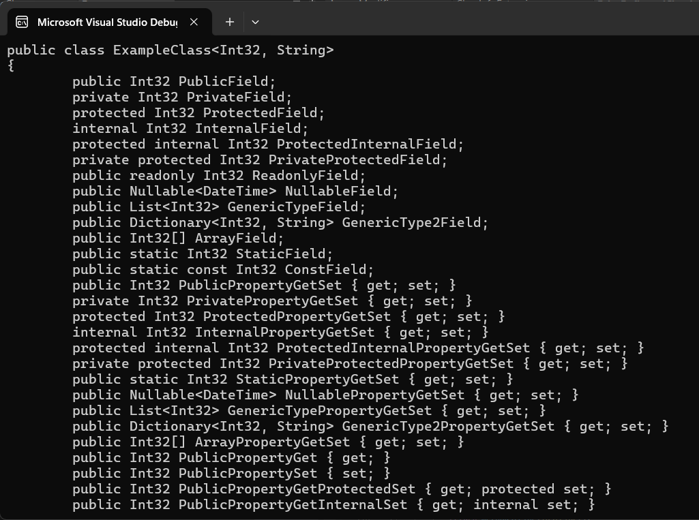

# ReflectionDocumenter

ReflectionDocumenter is a .NET library designed to create detailed documentation for your .NET classes. It uses reflection to create documentation for classes in their original declaration format.

## Screenshots

### Working example


## Features

- Creates documentation for classes in their original declaration format.
- Contains `ExampleClass` to demonstrate the usage of Reflection Documenter. It contains various types of members.

## Getting Started

### Installation

1. Clone the repository:

```bash
git clone https://github.com/VelSkorp/ReflectionDocumenter.git
cd ReflectionDocumenter
```

2. Build the project:

```bash
dotnet build
```

### Usage

1. Add a reference to ReflectionDocumenter in your project.

2. Import the `ReflectionDocumenter` namespace in your code:

```csharp
using ReflectionDocumenter;
```

3. Use the `ReflectedClassInfo` class to generate documentation for your assemblies:

```csharp
var classInfo = new ReflectedClassInfo();
var classDefinition = classInfo.GetClassDefinition(typeof(ExampleClass<int, string>));
Console.WriteLine(classDefinition);
```

Replace `ExampleClass<int, string>` with the class you want to get information about.

## Contributing

Contributions to SimpleGraphics are welcome! If you find any issues or have ideas for improvements, feel free to open an issue or submit a pull request on GitHub.

## License

This project is licensed under the MIT License - see the [LICENSE](LICENSE) file for details.